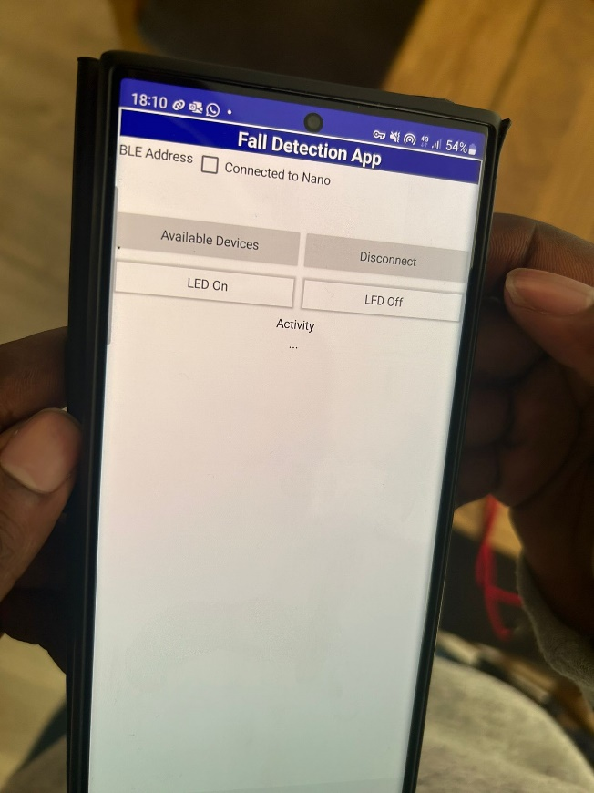

# Introduction

This project is based on using the Arduino Nano and Deep Learning to detect falls. Falls are usually unpredictable events that can lead to serious injury or prove fatal. Studies by the NHS report that dealing with falls cost over £2 Billion annually – in ambulance call outs, hospital admissions, treatment etc. Using accelerometer data from the Arduino Nano along with a DL architecture, a model will be implemented that detects falls and other activities of daily living e.g. walking.

The inspiration for this project is based on research and conversations with an NHS staff nurse who works in an inpatient unit. The NHS has no widely adopted device for monitoring patients under their care who are at risk of falls such as the elderly. Another NHS worker mentioned a use of crash pads which is used near the patients’ bed in the event of a fall – but this is limited to a single location. One NHS report indicates that 1 in 3 adults over the age of 65 and half of those over 80 suffer at least one fall each year, which could occur at home or even in hospitals without immediate response.

Some projects and real-world products regarding fall detection already exist such as safety alarm wearables from Buddi and SureSafe. These products inspired the direction of the project though in some cases machine learning is not being used – but other methods such as calculation of change in height and acceleration of the device.

# Research Question

Is it possible to create a low cost, non-invasive device that detects and alerts a carer when a fall occurs? Cameras are not being considered to maintain privacy and because they are limited to a particular location. Rather than being preventative, this project aims at improving responsiveness in dealing with cases of falls.

# Application Overview

The fall detection system should be able to detect a fall and display this in an app. It was initially thought that the app had to be created from scratch until the discovery of an open-source app called Nrf connect. This allows simple connection to Bluetooth. The building blocks of the project then include data collection, preprocessing, model architecture selection, training, deployment and evaluation.

Data capture and prototype models have been performed using Edge impulse – with different architectures experimented in Python using Visual Studio Code. As discussed in later sections, it was shown that the simple prototypes developed in Edge impulse provided suitable accuracy results and reasonable performance in testing and inference.

## Accelerometer

The Nano has onboard this three-axis electro-mechanical device that measures the rate of change of velocity of body relative to an observer. It will be used to generate data for training, testing and inference.

## Edge Impulse

Edge Impulse is a ML platform that allows users to easily develop and deploy models. It is used here to gather data and provide a working model to verify the feasibility of the research question.

## Nrf Connect

This is an Android application from Nordic Semiconductor – who’s processor is in use on the Nano. Connection can be made via Bluetooth BLE and the inference results are to be viewed on the app.

## Bluetooth Low Energy

BLE is optimised for low power use at low data rates, designed for use with batteries. This is ideal for small portable / wearable devices. Central devices are the clients that request information form peripheral devices – the servers. Peripheral devices can also be considered as bulletin boards and the central devices are the viewers of the board. Information presented by the peripheral devices are known as services and each service is subdivided into characteristics. In this case the central device (client) is the smartphone running Nrf connect, and the peripheral device (server) is the Nano advertising its characteristics. The “notify” mechanism automatically updates the value of a characteristic. This will be used for inferencing – where the data stream from the accelerometer continuously changes the predictions.

## MIT App Inventor

The MIT app inventor is an open-source platform for creating android applications using the block style drag and drop format. Alongside Bluetooth, it can also be used to connect the Arduino Nano to a smartphone and display the results from inference.

# Data

Data was collected with a wired USB connection between the Nano and laptop – due to Bluetooth functionality not being available on Edge Impulse. The data initially was collected for 6 classes – walking, idle, left-side fall, right-side fall, backwards fall and forward fall. It contains 1hr 8mins of data – 30mins of walking, 5mins of fall x4, 5 mins of idle. Walking was sampled at 1 min per sample whilst the other classes were 10 seconds for each sample.

# Model

The initial idea was to create a model to detect multiple activities of daily living – walking, idle and fall (four variations). Here is a link to the model: <https://studio.edgeimpulse.com/public/361363/live>. This test approach produced only 89% training accuracy over 100 epochs. It was then decided that an incremental approach would be taken starting with the data labelled as fall and no_fall.

## Edge Impulse models

The first model was a simple binary classification model with 2 hidden layers and an output layer of 2 classes – fall and no_fall. The four types of falls were collated into one – fall. Here is a link to the model: <https://studio.edgeimpulse.com/public/373825/live>

-   Training accuracy was 99.0% with a loss of 0.03 over 100 epochs.
-   Testing accuracy was 96.96%.

The dataset size was then increased (more idle data added to both training and test set) and a second model was generated – for fall, walking and idle. Here is a link to the model: <https://studio.edgeimpulse.com/public/382682/live>

-   Training accuracy was 99.9% with a loss of 0.01 over 30 epochs.
-   Testing accuracy reduced to 94.47%.

| **Fall, No_fall**         | **Fall, Walking, Idle**    |
|---------------------------|----------------------------|
| Input layer (39 features) | Input layer (414 features) |
| Dense layer (20 neurons)  | Dense layer (20 neurons)   |
| Dense layer (10 neurons)  | Dense layer (10 neurons)   |
| Output layer (2 classes)  | Output layer (3 classes)   |

 

### Working model

A third model was developed trained and deployed – based on the second model of three classes. The walking data was resampled at 10 seconds each sample – down from 60 seconds. This model also has a 6th order low pass filter of 8Hz cut off frequency. It is assumed that this filter applied to the raw data will remove unneeded high frequencies such as from sudden movements – apart from those wanted by the fall. This model performed well during inference and correctly identified the classes of motion. Here is the link: <https://studio.edgeimpulse.com/public/383839/live>

| **Fall, walking, idle (filtered)** |
|------------------------------------|
| Input layer (396 features)         |
| Dense layer (20 neurons)           |
| Dense layer (10 neurons)           |
| Output layer (3 classes)           |

The model training results may have been improved with more epochs, more layers or more neurons per layer – it was decided to leave it as it is to prevent overfitting the training data. The test results were lower than the training, probably indicating that the model was still overfitting on the training data and not generalizing as well to new unseen data.

## Visual Studio Code models

Multiple models were also implemented to compare it with the results from Edge impulse. The data was exported and converted to CSV format before being pre-processed and fed into the relevant model.

### Simple RNN

A RNN is a DL architecture that is well suited for time series data. Time series data is a sequence of successive observations of the same phenomena at different time intervals – such as accelerometer data. One problem with simple RNNs is vanishing gradient problem – which is slow learning due to reduction in the size of the gradients propagating back through the network. Training this network in Python provided a model with low accuracy over 30 epochs and deploying it on the Arduino was problematic – as explained in the results section.

Test Loss: 0.63, Test Accuracy: 0.72

 

### LSTM

Long Short-Term Memory is a type of RNN that removes the vanishing gradient problem, introducing memory cells and gates that regulate the flow of information through the network. This architecture was also implemented in Python and produced a suboptimal performance.

 

Test Loss: 0.60, Test Accuracy: 0.70

Both the RNN and LSTM models had low training and test accuracy, therefore it didn’t seem plausible to expect a good performance if deployed on the microcontroller.

# Experiments

The nature of the project meant that experiments had to be carried out on a deployed model and the performance analysed by whether the classification corresponded with the wearers’ activity. The results of the experiments are shown in the project demonstration video. The working model was uploaded to the Nano which was connected to a battery pack and connected to the Nrf connect app via Bluetooth BLE.

Inference results are shown under the first “Unknown Characteristic”.

##   Responsiveness

The system was tested given ten-second windows to allow for transitions. Each test waited for the inference result to change e.g. to test for walking, the system had to display fall or idle first.

|             | **Walking** | **Idle** | **Fall** |
|-------------|-------------|----------|----------|
| **Test 1**  | Walking     | Fall     | Fall     |
| **Test 2**  | Walking     | Walking  | Fall     |
| **Test 3**  | Walking     | Fall     | Fall     |
| **Test 4**  | Walking     | Fall     | Fall     |
| **Test 5**  | Walking     | Walking  | Fall     |
| **Test 6**  | Walking     | Walking  | Fall     |
| **Test 7**  | Walking     | Fall     | Idle     |
| **Test 8**  | Fall        | Fall     | Fall     |
| **Test 9**  | Walking     | Walking  | Fall     |
| **Test 10** | Walking     | Idle     | Fall     |

As displayed in the table, the Idle case was the most difficult to reach. When placed on a table, the inference results easily reads Idle, but when worn on the wrist, it can hardly be detected. This may have been due to the way the data for the Idle case was recorded – some data was recorded when it was placed on a table and some when it was just carried in the hand – not all data had it strapped around the wrist.

## Walking to Falling

This experiment required the device to be strapped to the wrist and the wearer to walk a short distance before simulating a fall unto a mattress. With three attempts, the device correctly detected, walking and fall – though there was a noticeable delay in the display of the transition on the Nrf connect app.

## Idle to Walking to Idle

In this experiment, the device was tested to see if it could detect a wearer standing still, walking and then standing still again. This was the longest experiment that did not work for over an hour. The system kept wrongly classifying walking with falling. Eventually after re-uploading the model, it worked for the three times it was tested.

## MIT App Inventor

Attempts were made to create an app that would perform just as the Nrf connect app – displaying the inference results, but also giving the opportunity to potentially add the SMS / phone call capability. It was possible to connect the app to the Nano and control the on-board LED with a smartphone, but it was unresponsive in displaying inference results.

 

# Results and Observations

The Python models proved to be difficult to upload to the Arduino. Steps were taken to convert the models to TesorFlowLite, then add this as a library to the Arduino .ino file but that did not work. Another method was to upload the model to Edge Impulse and then process it from there. The model was uploaded, converted to a .zip library but this also did not work when trying to deploy it on the Nano. The best results were found by using the models generated in Edge Impulse.

## Neural network with three classes

This model designed in Edge impulse performed well in classifying the idle and falling classes but did not classify the walking in any of the inference tests.

## Neural network with filtering

This was used as the final inference model with good performance in classifying activities. Tests were taken for transitioning between walking and falling, idle to walking and walking to idle. Though the model was somewhat slow in responsiveness at times, all three classes were correctly identified when the system functioned.

## Future work

This simple system works well, however there are clear limitations in transferring this to a real-world setting. Firstly, there needs to be a larger dataset size to account for a wider range of activities of daily living – such as walking up and down stairs. The data will also need to be collected in a similar way that inference will be performed.

Secondly, the system needs to account for delayed response in both inference and actual data input. Every person is different, so an elderly person may be susceptible to falls not just based on age but maybe due underlying health conditions. A person may fall in a staggered manner and not suddenly from a standing position – such as sliding from a chair or wheelchair.

Thirdly, such a system will need to account for false positives – a way of confirming that the wearer has fallen, maybe with a call response mechanism. Fourthly, experiments can be taken of the device in different locations such as waist worn to account for possible excessive arm movements.

To further improve on this project, two Nanos can be deployed with different models (such as RNNs and LSTMs) and compared against each other. The Fall Detection app can be completed and further developed to process the event of a fall, sending an SMS or a call to another device – simulating an emergency response. Taking these changes into account will help to develop a more robust system.
